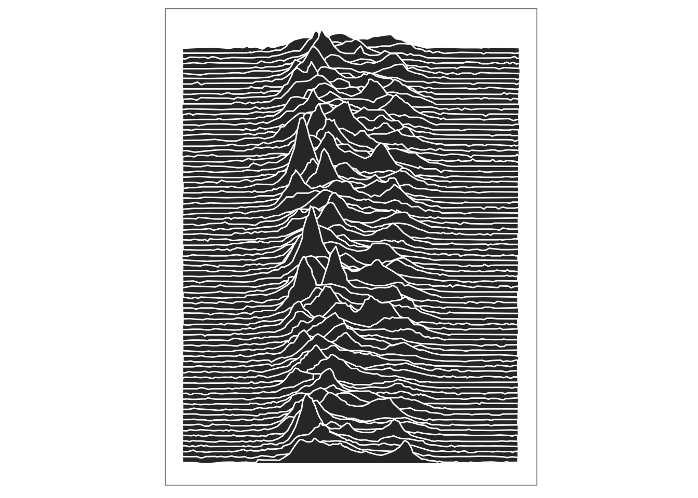

"EIGHTY SUCCESSIVE PERIODS of the first pulsar observed, CP1919 (Cambridge pulsar at 19 hours 19 minutes right ascension), are stacked on top of one another using the average period of 1.33730 seconds in this computer-generated illustration produced at the Arecibo Radio Observatory in Puerto Rico. Although the leading edges of the radio pulses occur within a few thousandths of a second of the predicted times, the shape of the pulses is quite irregular. Some of this irregularity in radio reception is caused by the effects of transmission through the interstellar medium. The average pulse width is less than 50 thousandths of a second." 

From "The Nature of Pulsars," by Jeremiah P. Ostriker, Scientific American, January 1971.


```r
# You'll need to nstall the package first  :)
devtools::install_github("coolbutuseless/CP1919")
```

```
## Downloading GitHub repo coolbutuseless/CP1919@master
```

```
## Error in download(dest, src, auth): client error: (404) Not Found
```

```r
library(CP1919)
library(ggplot2)

ggplot(CP1919, aes(x, ymax=y, ymin=0, group=line)) +
  geom_ribbon(colour='white') +
  theme_bw() +
  theme(legend.position='none') + 
  theme(panel.grid = element_blank(),
        axis.text  = element_blank(),
        axis.title = element_blank(),
        axis.ticks = element_blank()) + 
  coord_fixed()
```

 

